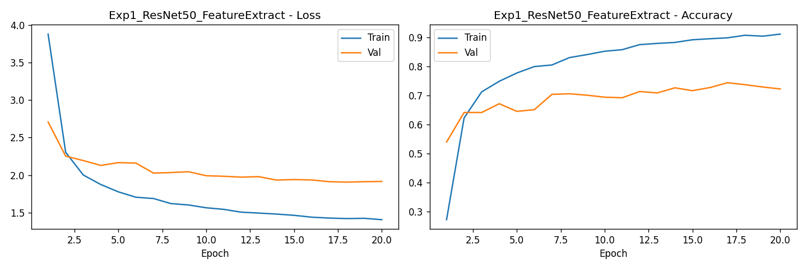
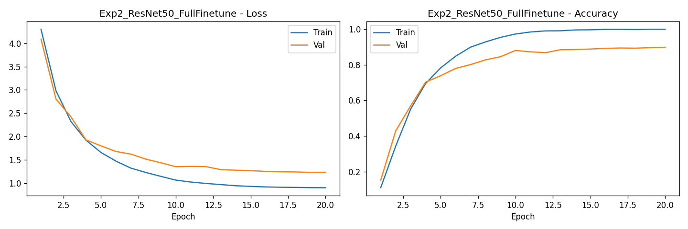
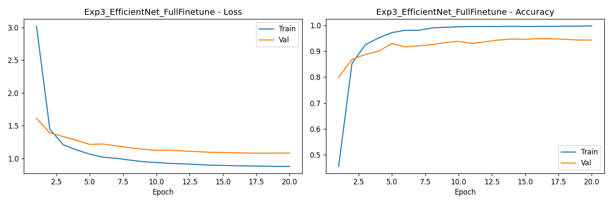
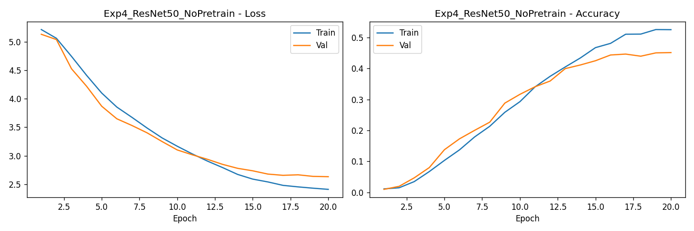
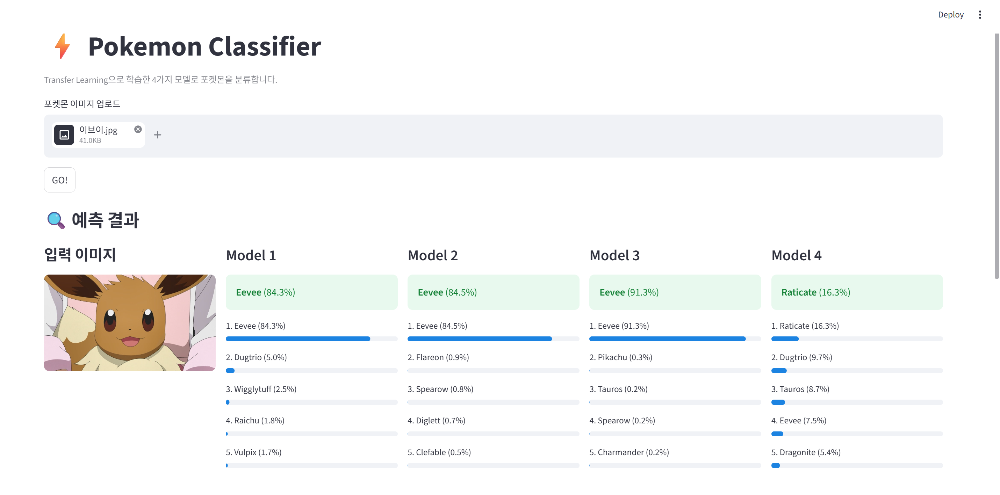

# ⚡ PokeLens

포켓몬 이미지를 입력하면 포켓몬의 이름을 맞추는 이미지 분류기입니다.  
사전학습된 CNN 모델을 전이학습(Transfer Learning)하여 150종의 포켓몬을 분류합니다.

---

## 실험 설계

총 4가지 실험 설정으로 모델을 학습하여 성능을 비교하였습니다.  
각 실험은 **backbone 아키텍처**, **fine-tuning 전략**, **pretrained weight 사용 여부** 중 하나의 변수를 바꾸어 그 영향을 분석합니다.

| 모델 | Backbone | Strategy | Pretrained | 비교 목적 |
|------|----------|----------|-----------|----------|
| Model 1 | ResNet50 | Feature Extraction | ✅ | 기준 모델 |
| Model 2 | ResNet50 | Full Fine-tuning | ✅ | fine-tuning 전략 효과 (vs Model 1) |
| Model 3 | EfficientNetB0 | Full Fine-tuning | ✅ | backbone 아키텍처 효과 (vs Model 2) |
| Model 4 | ResNet50 | Full Fine-tuning | ❌ | pretrained weight 효과 (vs Model 2) |

### 실험 변수 설명

**Feature Extraction vs Full Fine-tuning**  
Feature Extraction은 backbone의 모든 가중치를 고정하고 마지막 분류 레이어만 학습하는 방식입니다. Full Fine-tuning은 pretrained 가중치에서 시작하되 모든 레이어를 재학습합니다. Model 1과 Model 2를 비교하면 fine-tuning 전략이 성능에 미치는 영향을 확인할 수 있습니다.

**ResNet50 vs EfficientNetB0**  
ResNet50은 잔차 연결(Residual Connection)을 활용한 클래식한 backbone이고, EfficientNetB0은 더 적은 파라미터로 높은 성능을 내도록 설계된 경량 모델입니다. Model 2와 Model 3은 전략이 동일하므로 순수하게 backbone 차이를 비교할 수 있습니다.

**Pretrained vs No Pretrain**  
Model 4는 Model 2와 모든 조건이 동일하지만 ImageNet pretrained weight 없이 완전 랜덤 초기화에서 시작합니다. 이를 통해 전이학습의 효과를 직접 수치로 확인할 수 있습니다.

---

## 실험 결과

| 모델 | Backbone | Strategy | Pretrained | Test Acc | Precision | Recall | F1 |
|------|----------|----------|-----------|----------|-----------|--------|-----|
| Model 1 | ResNet50 | Feature Extraction | ✅ | 0.7449 | 0.7550 | 0.7555 | 0.7342 |
| Model 2 | ResNet50 | Full Fine-tuning | ✅ | 0.9198 | 0.9206 | 0.9248 | 0.9148 |
| **Model 3** | **EfficientNetB0** | **Full Fine-tuning** | **✅** | **0.9541** | **0.9544** | **0.9570** | **0.9517** |
| Model 4 | ResNet50 | Full Fine-tuning | ❌ | 0.4907 | 0.4798 | 0.5012 | 0.4561 |

### 결과 분석

- **Model 1 → Model 2 (전략 변경)**: Feature Extraction에서 Full Fine-tuning으로 바꾸자 정확도가 74.5% → 91.9%로 약 17%p 상승하였습니다. backbone을 고정하면 포켓몬 특유의 시각적 특징을 학습하는 데 한계가 있음을 확인할 수 있습니다.

- **Model 2 → Model 3 (backbone 변경)**: ResNet50을 EfficientNetB0으로 교체하자 정확도가 91.9% → 95.4%로 추가 상승하였습니다. EfficientNet의 compound scaling 설계가 포켓몬 분류에도 효과적임을 보여줍니다.

- **Model 2 vs Model 4 (pretrained 유무)**: 동일한 구조에서 pretrained weight를 제거하자 정확도가 91.9% → 49.1%로 절반 가까이 떨어졌습니다. 7,000장의 데이터만으로는 처음부터 학습하기에 턱없이 부족하며, 전이학습의 효과가 매우 크다는 것을 확인할 수 있습니다.

---

## Learning Curve

| Model 1 | Model 2 |
|---------|---------|
|  |  |

| Model 3 | Model 4 |
|---------|---------|
|  |  |

---

## 데이터셋

- **출처**: [7,000 Labeled Pokemon - Kaggle](https://www.kaggle.com/datasets/lantian773030/pokemonclassification)
- **클래스 수**: 150종
- **총 이미지 수**: 약 7,000장
- **분할 비율**: Train 70% / Val 15% / Test 15%

---

## 분류 실행 결과



---

## 실행 방법

```bash
pip install streamlit torch torchvision pillow

streamlit run app.py
```

> `results/` 폴더에 `.pth` 모델 파일과 `class_names.json`이 있어야 합니다.
